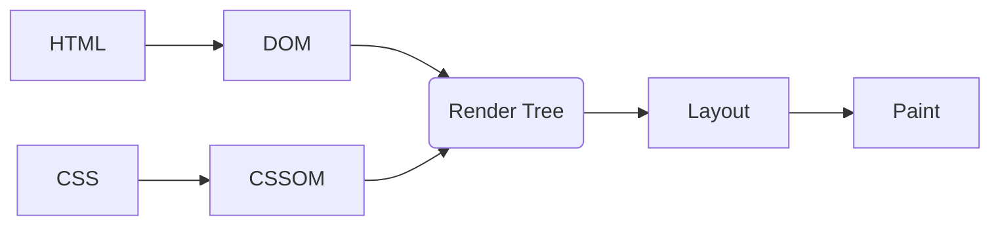
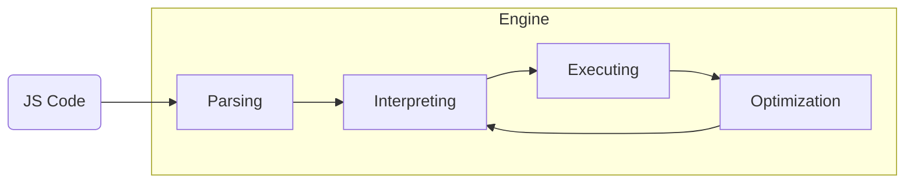

---
# try also 'default' to start simple - eloc
theme: eloc
# random image from a curated Unsplash collection by Anthony
# like them? see https://unsplash.com/collections/94734566/slidev
background: https://cover.sli.dev
# some information about your slides, markdown enabled
title: Welcome to Slidev
info: |
  ## Slidev Starter Template
  Presentation slides for developers.

  Learn more at [Sli.dev](https://sli.dev)
# apply any unocss classes to the current slide
class: text-center
# https://sli.dev/custom/highlighters.html
highlighter: shiki
# https://sli.dev/guide/drawing
drawings:
  persist: false
# slide transition: https://sli.dev/guide/animations#slide-transitions
transition: slide-left
# enable MDC Syntax: https://sli.dev/guide/syntax#mdc-syntax
mdc: true


---

# First Principles of Web Development

<div class="abs-br m-6 flex gap-2">
  <button @click="$slidev.nav.openInEditor()" title="Open in Editor" class="text-xl slidev-icon-btn opacity-50 !border-none !hover:text-white">
    <carbon:edit />
  </button>

  <a href="https://github.com/slidevjs/slidev" target="_blank" alt="GitHub" title="Open in GitHub"
    class="text-xl slidev-icon-btn opacity-50 !border-none !hover:text-white">
    <carbon-logo-github />
  </a>
</div>

<!--
- Introduce Myself
-->

---

First principles thinking is a method of problem-solving that involves breaking down <span v-mark.box.blue>complex issues</span> into their most <span v-mark.box.green>basic and fundamental parts</span>.

<!--
- Motive for giving this talk
- End: Question we are going to answer this talk
-->

---

How does <span v-mark.underline.green>HTML & CSS</span> work?
<br/>
<br/>
What <span v-mark.underline.yellow>JavaScript</span> does under the hood?
<br/>
<br/>
Why do we need <span v-mark.underline.red>web frameworks</span>?

<!--
- Question answering this talk
- End: Let answer the first question
-->

---

## How Does HTML & CSS Work?

<!--
- How does it render in the browser?
-->

---

```html {all|3-5|7-12|8}
<!DOCTYPE html>
  <html>
      <head>
          <title>Basic HTML & CSS File </title>
      </head>

      <body>
          <h1 style="color: red; font-size: 40px;">Hello World!</h1>
          <div Class='btn'>
              <button> Don't Press </button>
          </div>
      </body>
  </html>
```

<!--
- Basic HTML Scripts
  - Head
  - Body
  - Inline CSS
- End: How do we render this on the browser?
-->

---



---


<!--
- Basic Web App
- Go to ONLINE IDE
- End: Answer 2nd question
-->

---

## JavaScript Under the Hood

<!--
- How to make it interactive
-->

---

### JS Engines

<span v-mark.box.green>Parsing</span>, <span v-mark.underline.orange>Interpreting</span> and <span v-mark.circle.red>Executing</span> JS


---



<!--
- JIT
- Parsed into AST
- Interpreted into ByteCoode
- Executed
https://astexplorer.net/
-->


---


````md magic-move {lines: true}
```js
const a = 5;

function second(a) {
  const b = thrid(1,2);
  return a + b;
}

function thrid(x, y) {
  const z = 3;
  return x + y + z;
}

second(a)
```

```js
// global
a = 5
second = function()
thrid = function()

```

```js {1-3}
// second
argument = [5]
b = thrid(1, 2)

// global
a = 5
second = function()
thrid = function()
```

```js {1-3}
//thrid
argument=[1,2]
c = 3

// second
argument = [5]
b = thrid(1, 2)

// thrid
a = 5
second = function()
thrid = function()
```

```js {1-3}
// second
argument = [5]
b = 11

// global
a = 5
second = function()
thrid = function()
```

```js {1-3}
// second
argument = [5]
b = 11

// global
a = 5
second = function()
thrid = function()
```

```js {1-3}
// thrid
a = 5
second = 16
thrid = function()
```

````


---

### JS Runtimes
<span v-mark.circle.green>Environment</span> that allow the execution of JS code

---


<!--
- Web APIs: allow functionality that the language itself doesn’t support e.g HTTP requests, timer, DOM interaction
- call back queue: mechanism that coordinates the execution of asynchronous cod
-->

---

```html {all|11-21|13-14|16-20}
<!DOCTYPE html>
<html>
<head>
    <title>Basic HTML & CSS File</title>
</head>
<body>
    <h1 style="color: red; font-size: 40px;">Hello World!</h1>
    <div class="btn">
        <button id="myButton">Don't Press</button>
    </div>

    <script>
        // Get the button element by its ID
        const button = document.getElementById('myButton');

        // Add an event listener to the button to listen for clicks
        button.addEventListener('click', function() {
            // Display a pop-up alert when the button is pressed
            alert('You pressed the button!');
        });
    </script>
</body>
</html>
```

<!--
- Go to Online IDE
-->

---


## Why do we need web frameworks?

---

A web framework is a software platform designed to support the development of web applications, including web services, web resources, and web APIs

---

- Component-based architecture
<br/>
<br/>
- Virtual DOM
<br/>
<br/>
- State Management
<br/>
<br/>
- Data Binding
<br/>
<br/>
- Server Communication

---

```jsx {4|6-14}
import React, { useState } from 'react';

export function App() {
  const [count, setCount] = useState(0)

  return (
       <div style={{backgroundColor: 'white', padding: '5px' }}>
        <h1 style={{ color: 'red', fontSize: '40px' }}>Hello World!</h1>
        <div className='btn'>
          <button onClick={() => setCount(count + 1)}>Counter</button>
          <p>{count}</p>
        </div>
      </div>
  );
}

```

---

Thank you for listing

---
